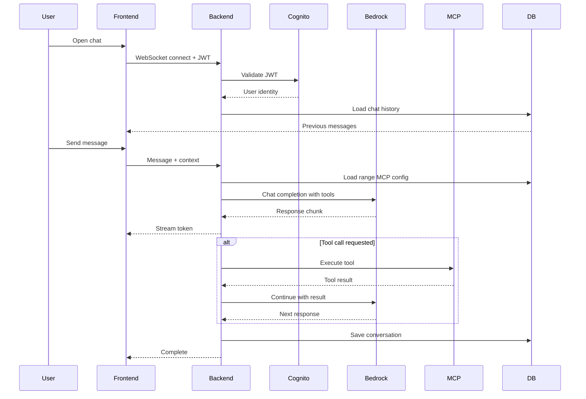
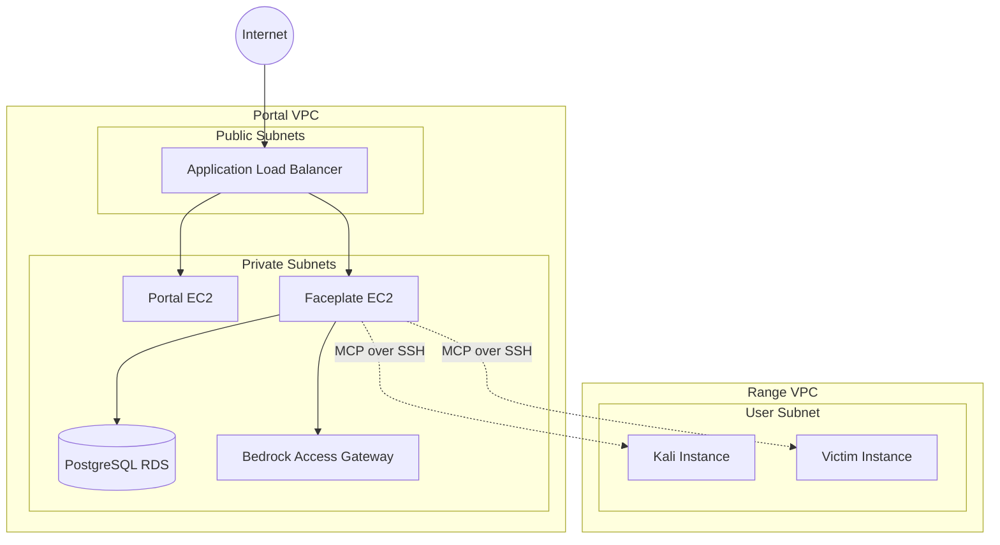
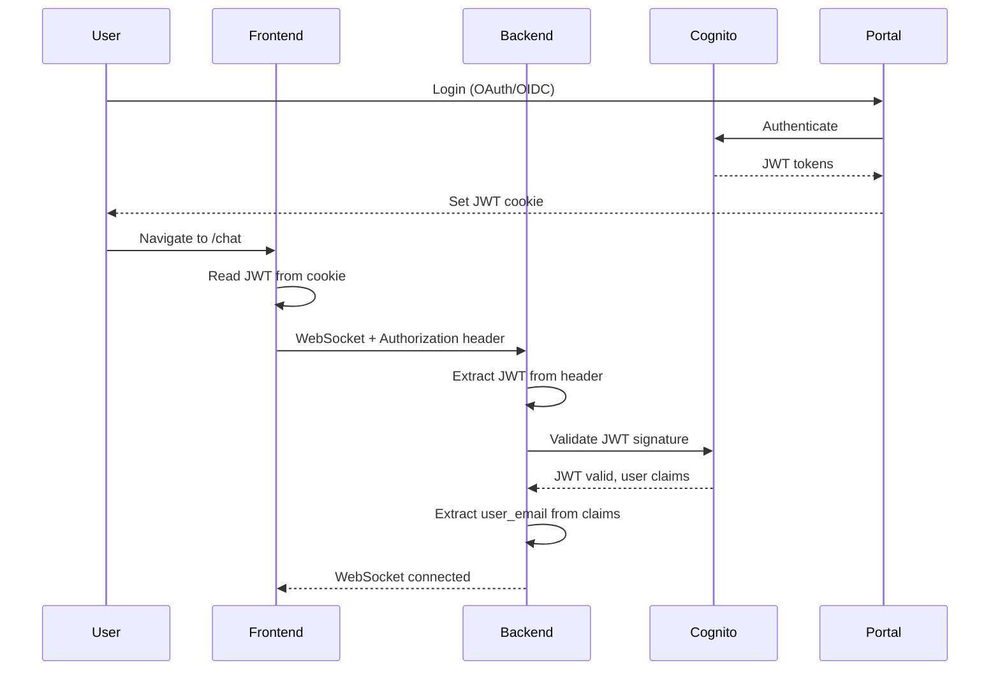
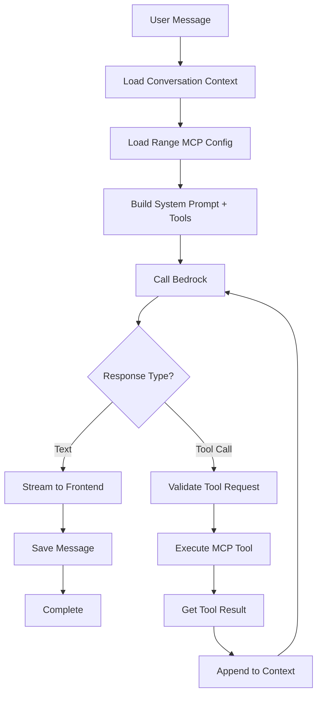
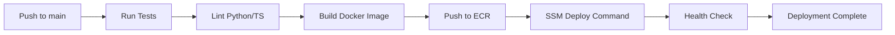

# Architecture

## System Overview

Faceplate is a lightweight chat interface consisting of two primary components:

1. **Backend** (FastAPI): Agent orchestration, MCP tool calling, auth validation
2. **Frontend** (React): Chat UI, WebSocket client, message rendering

Both components are stateless and rely on PostgreSQL for persistence and Cognito for authentication.

## High-Level Flow



## Component Architecture

### Backend (FastAPI)

**Purpose:** Agent orchestration, MCP management, authentication, persistence

**Key Modules:**
- `main.py` - FastAPI app, WebSocket endpoints, health checks
- `auth.py` - Cognito JWT validation, user context
- `agent.py` - Agent loop, tool calling orchestration
- `mcp_manager.py` - MCP server discovery and invocation
- `models.py` - Database models (SQLAlchemy)
- `config.py` - Environment variables, settings

**Dependencies:**
- `fastapi` - Web framework
- `uvicorn` - ASGI server
- `python-jose` - JWT validation
- `httpx` - Bedrock/BAG HTTP client
- `sqlalchemy` - PostgreSQL ORM
- `websockets` - Real-time streaming

**Responsibilities:**
1. Validate Cognito JWT tokens
2. Load user's active range and MCP configuration
3. Execute agent loop with tool calling
4. Stream responses to frontend via WebSocket
5. Persist conversation history to PostgreSQL

### Frontend (React + Vite)

**Purpose:** Chat UI, message rendering, WebSocket client

**Key Components:**
- `App.tsx` - Root component, routing, auth state
- `Chat.tsx` - Main chat interface
- `MessageList.tsx` - Message rendering with streaming
- `MessageInput.tsx` - User input, send button
- `ModelSelector.tsx` - Bedrock model selection
- `useWebSocket.ts` - WebSocket hook for streaming
- `useAuth.ts` - JWT management, Cognito integration

**Dependencies:**
- `react` - UI library
- `vite` - Build tool, dev server
- `@tanstack/react-query` - Data fetching, caching
- `zustand` - State management (minimal)

**Responsibilities:**
1. Maintain WebSocket connection to backend
2. Display messages with streaming updates
3. Handle user input and send to backend
4. Show tool execution status
5. Manage JWT token refresh

## Infrastructure

### Deployment Model



**Network:**
- Faceplate backend in private subnet (same as Portal)
- Access via ALB with HTTPS termination
- Egress via NAT Gateway for Bedrock/Cognito
- MCP SSH connections to Range VPC instances

**Resources:**
- EC2: t3.medium (2 vCPU, 4GB RAM) - same as Portal
- RDS: Shared PostgreSQL instance (separate schema)
- ALB: Path-based routing (`/chat/*` → Faceplate)
- Security Groups: Inbound from ALB only, outbound to RDS/NAT

## Data Model

### Database Schema

**Table: `conversations`**
```sql
CREATE TABLE conversations (
    id UUID PRIMARY KEY DEFAULT gen_random_uuid(),
    user_email VARCHAR(255) NOT NULL,
    range_id UUID NOT NULL,
    created_at TIMESTAMP NOT NULL DEFAULT NOW(),
    updated_at TIMESTAMP NOT NULL DEFAULT NOW(),
    title VARCHAR(255),
    INDEX idx_user_range (user_email, range_id)
);
```

**Table: `messages`**
```sql
CREATE TABLE messages (
    id UUID PRIMARY KEY DEFAULT gen_random_uuid(),
    conversation_id UUID NOT NULL REFERENCES conversations(id) ON DELETE CASCADE,
    role VARCHAR(20) NOT NULL CHECK (role IN ('user', 'assistant', 'tool')),
    content TEXT NOT NULL,
    tool_calls JSONB,
    tool_results JSONB,
    created_at TIMESTAMP NOT NULL DEFAULT NOW(),
    INDEX idx_conversation (conversation_id, created_at)
);
```

**Table: `mcp_configs`**
```sql
CREATE TABLE mcp_configs (
    id UUID PRIMARY KEY DEFAULT gen_random_uuid(),
    range_id UUID NOT NULL UNIQUE,
    config JSONB NOT NULL,
    created_at TIMESTAMP NOT NULL DEFAULT NOW(),
    updated_at TIMESTAMP NOT NULL DEFAULT NOW(),
    FOREIGN KEY (range_id) REFERENCES ranges(id) ON DELETE CASCADE
);
```

### MCP Configuration Format

Stored per-range in `mcp_configs.config`:

```json
{
  "servers": [
    {
      "name": "kali",
      "transport": "ssh",
      "host": "10.1.1.10",
      "port": 22,
      "user": "kali",
      "key_path": "/secrets/range-123-kali.pem"
    },
    {
      "name": "victim",
      "transport": "ssh",
      "host": "10.1.1.20",
      "port": 22,
      "user": "ubuntu",
      "key_path": "/secrets/range-123-victim.pem"
    }
  ]
}
```

## Authentication Flow



**JWT Claims Used:**
- `email` - User identity for conversation ownership
- `sub` - Cognito user ID
- `cognito:groups` - (future) Role-based access control

**Security:**
- JWT signature validated against Cognito public keys
- Tokens expire after 1 hour (configurable)
- Refresh tokens handled by Portal
- WebSocket requires valid JWT on connect

## Agent Loop

### Tool Calling Flow



### Tool Definition

Backend provides Bedrock with available tools from MCP servers:

```json
{
  "tools": [
    {
      "name": "kali_execute_command",
      "description": "Execute a shell command on the Kali attack machine",
      "parameters": {
        "type": "object",
        "properties": {
          "command": {
            "type": "string",
            "description": "The shell command to execute"
          }
        },
        "required": ["command"]
      }
    },
    {
      "name": "victim_read_file",
      "description": "Read a file from the victim machine",
      "parameters": {
        "type": "object",
        "properties": {
          "path": {
            "type": "string",
            "description": "Absolute path to the file"
          }
        },
        "required": ["path"]
      }
    }
  ]
}
```

### Error Handling

**Network Errors:**
- Bedrock timeout: Retry with exponential backoff (3 attempts)
- MCP connection failure: Return error to LLM, let it adapt
- WebSocket disconnect: Frontend reconnects, resumes conversation

**Tool Execution Errors:**
- Command failure on Kali/Victim: Pass stderr to LLM as tool result
- Permission denied: LLM sees error, can adjust approach
- Timeout: 30s max per tool call, return timeout error

**Agent Loop Safety:**
- Max 20 tool calls per conversation turn
- Max 10 consecutive tool calls without user message
- Rate limit: 100 messages per user per hour

## Scalability Considerations

### Current MVP (Single EC2)

- Handles ~50 concurrent users
- WebSocket connections: ~500 max
- No horizontal scaling needed initially

### Future Growth

**When to scale:**
- \> 40 concurrent WebSocket connections
- \> 80% CPU utilization sustained
- \> 70% memory utilization

**Scaling approach:**
1. Add second EC2 instance
2. ALB distributes WebSocket connections
3. Sticky sessions based on conversation ID
4. PostgreSQL connection pooling (already implemented)

**Not needed:**
- Redis for session state (JWT is stateless)
- Message queue (direct WebSocket is fine)
- Load balancer health checks (ALB handles it)

## Monitoring

### Health Checks

**ALB Health Check:**
- Endpoint: `GET /health`
- Expected: `200 OK`
- Interval: 30s
- Healthy threshold: 2
- Unhealthy threshold: 3

**Application Metrics:**
- Active WebSocket connections
- Average response time per message
- Tool call success/failure rate
- Bedrock API latency
- MCP connection pool status

### Logging

**CloudWatch Log Groups:**
- `/faceplate/application` - App logs
- `/faceplate/access` - HTTP access logs
- `/faceplate/websocket` - WebSocket connection events

**Log Levels:**
- `INFO` - User actions, tool calls, completions
- `WARNING` - Retries, slow responses (>5s)
- `ERROR` - Exceptions, tool failures, auth failures

## Security

### Network Isolation

- Backend in private subnet (no direct internet)
- Only ALB can reach backend (security group)
- Backend can reach: RDS, NAT, Range VPC (SSH)
- Range VPC instances: SSH only from Portal VPC CIDR

### Secrets Management

**AWS Secrets Manager:**
- `faceplate/db-credentials` - PostgreSQL connection
- `faceplate/jwt-public-key` - Cognito public key (cached)
- `faceplate/ssh-keys/{range_id}` - Per-range SSH keys

**Environment Variables (from Secrets):**
- `DATABASE_URL` - PostgreSQL connection string
- `COGNITO_USER_POOL_ID` - For JWT validation
- `BEDROCK_ENDPOINT` - BAG URL
- `MCP_KEY_BUCKET` - S3 bucket for SSH keys

### Data Protection

- All data in transit: TLS 1.3 (ALB → Backend → RDS)
- Data at rest: RDS encryption enabled (AWS managed key)
- SSH keys: Encrypted in Secrets Manager
- JWT validation: Public key cryptography
- No sensitive data in logs (PII scrubbed)

## Deployment Pipeline

### CI/CD Workflow



**GitHub Actions Workflow:**
1. Run backend tests (pytest)
2. Run frontend tests (vitest)
3. Lint Python (ruff)
4. Lint TypeScript (eslint)
5. Build Docker image
6. Push to ECR
7. SSM command to EC2: pull and restart
8. Wait for ALB health check pass

**Rollback:**
- Previous image tagged as `:rollback`
- SSM command: `docker pull <image>:rollback && docker-compose up -d`
- Automatic on health check failure

## Integration with Shifter Portal

### Shared Resources

- PostgreSQL RDS instance (separate schema: `faceplate`)
- Cognito User Pool (same JWT issuer)
- ALB (path-based routing)
- VPC, subnets, security groups

### Portal Responsibilities

- User authentication (Cognito OIDC)
- Range provisioning and lifecycle
- SSH key generation for MCP access
- Writing MCP configs to `mcp_configs` table

### Faceplate Responsibilities

- Chat interface and agent loop
- MCP tool execution
- Conversation persistence
- Streaming LLM responses

### Data Flow Between Systems

1. Portal creates range → writes `ranges` table
2. Portal generates SSH keys → stores in Secrets Manager
3. Portal writes MCP config → writes `mcp_configs` table
4. User opens Faceplate → reads `ranges` + `mcp_configs`
5. Faceplate executes tools → uses SSH keys from Secrets Manager
6. Faceplate saves chat → writes `conversations` + `messages`

## Technology Choices

### Why FastAPI?

- Excellent async support for WebSocket streaming
- Native Python (matches Portal's Django stack)
- Fast development with automatic OpenAPI docs
- Easy to test and mock

### Why React + Vite?

- Modern, fast build tooling
- Minimal boilerplate compared to Next.js
- Easy WebSocket integration
- Static build can be served by FastAPI

### Why Not Django?

- Django Channels adds complexity
- FastAPI is lighter for API-only backend
- Better async support for streaming
- Separate from Portal reduces coupling

### Why PostgreSQL (not MongoDB)?

- Shared with Portal (no new database)
- Strong consistency for chat history
- JSONB for MCP configs (flexible schema)
- Better ops familiarity

### Why WebSocket (not SSE)?

- Bidirectional for future features
- Better browser support for long-running connections
- Can send control messages (cancel, pause)
- Native FastAPI support

