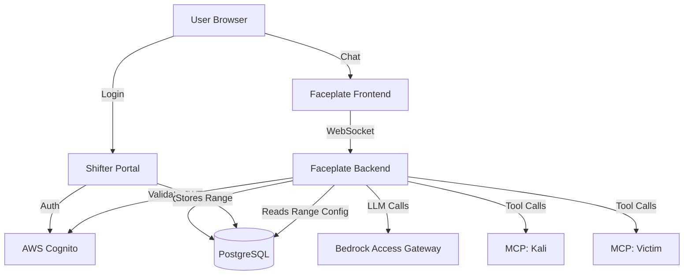

# Faceplate

**Lightweight agentic chat interface for Shifter cyber range.**

Faceplate is a minimal, custom-built chat UI that provides AI-powered control over cyber range environments. It replaces OpenWebUI as a lighter, purpose-built alternative focused exclusively on agentic tool calling via MCP.

## What is Faceplate?

A streamlined chat interface that connects users to AWS Bedrock models with direct MCP tool integration. Users authenticate via Cognito, select their range, and interact with AI agents that can control Kali and victim machines through MCP servers.

## Why Faceplate?

| OpenWebUI | Faceplate |
|-----------|-----------|
| Heavy with features we don't need | Purpose-built for cyber range |
| Complex customization | Simple, maintainable codebase |
| Generic tool calling | MCP-first design |
| Unstable in production | Controlled by us |

**Zero bloat. Zero complexity. Zero upstream surprises.**

## Architecture

## Components

| Component | Technology | Purpose |
|-----------|-----------|---------|
| Frontend | React + Vite | Chat UI, message display, streaming |
| Backend | FastAPI | Agent loop, MCP orchestration, auth |
| Auth | AWS Cognito | SSO, MFA, JWT validation |
| Database | PostgreSQL | Chat history, range metadata |
| LLM | AWS Bedrock | Claude Sonnet 4.5 via BAG |
| Tools | MCP Servers | SSH control of Kali and victim VMs |

## Core Features

- **Single Sign-On**: Reuses Shifter Portal's Cognito authentication
- **Range-Aware**: Automatically loads MCP configs for user's active range
- **Streaming Responses**: Real-time token streaming via WebSocket
- **Tool Calling**: Native MCP integration for Kali and victim control
- **Chat Persistence**: Conversation history stored in PostgreSQL
- **Model Selection**: Choose between available Bedrock models

## Non-Features (Intentionally Excluded)

- Document upload/RAG
- Image generation
- Multiple simultaneous conversations
- Plugins/extensions
- Admin interface (use Portal instead)
- Custom model endpoints
- Voice/video

## Use Cases

1. **Range Setup**: "Configure a vulnerable PHP app on 10.0.1.50 with SQLi"
2. **Attack Execution**: "Scan the target, find vulnerabilities, exploit and get root"
3. **Investigation**: "What processes are running on the victim?"
4. **Cleanup**: "Remove all artifacts from /tmp on both machines"

## Deployment

Faceplate deploys alongside Shifter Portal in the same VPC:

- Frontend: Static files served by backend
- Backend: Docker container on EC2
- Database: Shared PostgreSQL RDS instance
- Access: HTTPS via ALB, Cognito JWT required

## Development Timeline

Built using AI-assisted development in parallel with Shifter:

- **Day 1**: Backend API, auth, basic agent loop
- **Day 2**: Frontend UI, WebSocket streaming, MCP integration, deployment

## Documentation

- [Architecture](architecture.md) - System design and component interaction
- [Backend](backend.md) - FastAPI server, agent loop, MCP integration
- [Frontend](frontend.md) - React UI, WebSocket client, message rendering
- [Deployment](deployment.md) - Docker, EC2, CI/CD pipeline
- [Security](security.md) - Auth, isolation, secrets management
- [Development](development.md) - Local setup, testing, contributing

## License

MIT (matches Shifter)

